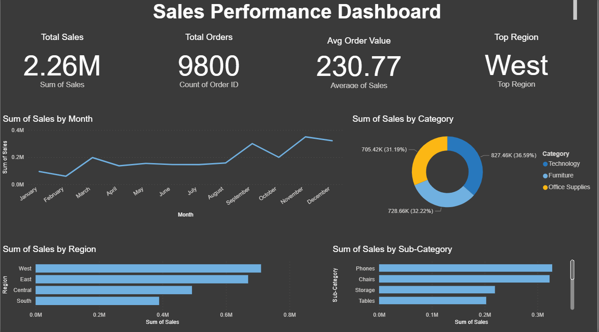

# Sales Performance Dashboard

## Dashboard Preview

## Overview
Interactive sales dashboard analyzing 9,800 transactions worth $2.26M 
using Python and Power BI.

## Tools Used
- Python (Pandas, Matplotlib, Seaborn)
- Power BI
- Git & GitHub
- Kaggle Dataset — Superstore Sales

## Key Findings
- Technology is the top revenue category at 36.59%
- West region leads with highest sales
- December shows peak monthly sales
- Phones and Chairs are top sub-categories

## Project Structure
- `sales dashboard project.py` — Python analysis code
- `Sales_Dashboard.pbix` — Power BI dashboard file
- `dashboard.png.png` — Dashboard screenshot
- `monthly_sales.png` — Monthly sales trend chart
- `sales_by_category.png` — Sales by category chart
- `sales_by_region.png` — Sales by region chart
- `top_subcategories.png` — Top sub-categories chart

## How to Run
1. Clone this repository
2. Install requirements: `pip install pandas matplotlib seaborn kagglehub`
3. Run `sales dashboard project.py`
4. Open `Sales_Dashboard.pbix` in Power BI Desktop

## Resume
Built as part of my Data Analyst portfolio to demonstrate Python data analysis,
visualization, and Power BI dashboard skills.
